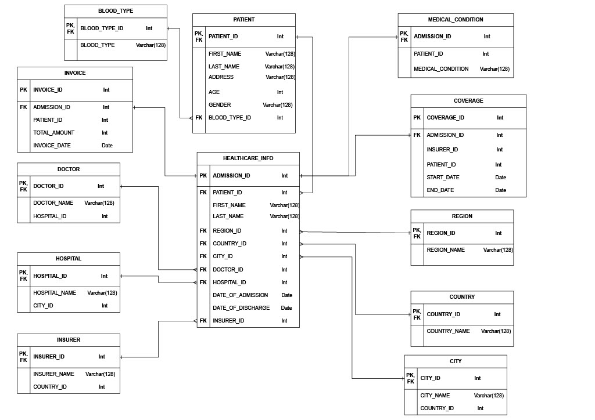

# SQL Project _ Healthcare Database

**1. Database Idea:**

We created a database that records the healthcare information of patients in fictional hospital named Happiness. The database reflects the healthcare industry’s key aspects in the 
following ways:
- Healthcare information of patients: The database contains tables of patient healthcare information which are designed to store detailed patient records including personal information, demographics, medical history, blood type and health insurance information. Recording and maintaining patient 
healthcare information is crucial for providing medical care. It allows the healthcare provider to 
have access to patients’ medical history, treatments, reducing the risk of medical errors and 
improving hospital services.
- Geographical information: The database includes geographic data such as region, country, and 
city. These data connected with detailed information of hospital data illustrate information of 
hospital locations around the world, allowing the hospital to manage healthcare information of its 
patients in different branches around the world.
- Hospital and doctors’ information: The database consists of tables for doctors and the hospital 
where the doctors work in. These records reflect the management system of medical staff, which 
are vital to the healthcare industry.
- Medical conditions of patients: The database records information on medical conditions of 
patients. Recording medical conditions is fundamental to help healthcare providers such as doctors 
and nurses to provide appropriate effective medical care. 
- Insurance information: The database includes tables for insurance companies and insurance 
coverage that patients are entitled to. With insurance, patients can have financial protection as it 
helps cover the cost of medical services, treatments, and medications for patients. Insurance 
companies vary based on the hospital’s branch from which patients get treatment.

**2. Entity Relationship (ER) Model**

The database contains 12 tables, each designed with different attributes to capture and manage 
healthcare-related data. The ER model for our database is illustrated in the following figure. Each 
entity in database includes entity name, attributes, attributes’ data types, relationships with other 
entities, and primary keys and foreign keys used to link two entities together. Relationships 
between entities in our database include one-to-one, many-to-one, one-to-many, and many-to-many relationships.

**3. Description of each relationship (between tables)**

The association among entities in our database is designed in different ways. The database includes 
three main types of relationships: one-to-one, one-to-many/many-to-one, and many-to-many.

**One-to-one relationship**
In our database, the tables `MEDICAL_CONDITION` ,`COVERAGE`, and `INVOICE` have 
one-to-one relationship with `HEALTHCARE_INFO` table. All three tables are uniquely linked 
with `HEALTHCARE_INFO` table by attribute `ADMISSION_ID`. These one-to-one 
relationships are created to enhance data management. Some data attributes such as coverage 
information and medical conditions of patients are rarely used or sensitive. By creating separate 
tables for these attributes, we are able to eliminate data redundancy and effectively control access 
to data. 

**One-to-many and Many-to-one relationship**
The tables `BLOOD_TYPE` and `PATIENT` are linked together with one-to-many relationship. 
Each record of attribute `BLOOD_TYPE` in `BLOOD_TYPE` table is associated with multiple 
records `PATIENT_ID` in `PATIENT` table. Furthermore, the tables `REGION`, `COUNTRY`, 
and `CITY` are connected to `HEALTHCARE_INFO` with one-to-many relationships over 
attributes `REGION_ID`, `COUNTRY_ID`, and `CITY_ID`, respectively. The purpose of 
creating these one-to-many relationships is to represent hierarchical data. Each patient can have 
only one blood type, but each blood type can belong to many different patients. Additionally, 
creating one-to-many relationships allows us to avoid data duplication. Instead of storing the same 
geographic data multiple times, we can create separate related tables and use a foreign key to 
reference relevant tables.

**Many-to-many relationship**
In our database, many-to-many relationships are reflected in the association between table 
`HOSPITAL` and `PATIENT` as well as table `DOCTOR` and `PATIENT`. Each patient in our 
database can receive treatment from multiple doctors in multiple hospitals, and each hospital or 
doctor can have many patients. This type of relationship is created to represent the complexity of
the healthcare industry where each record in one entity can be linked to multiple records in another 
entity, and no exclusive relationship can exist between these entities. It helps to maintain data 
integrity and relational structure in our database.

